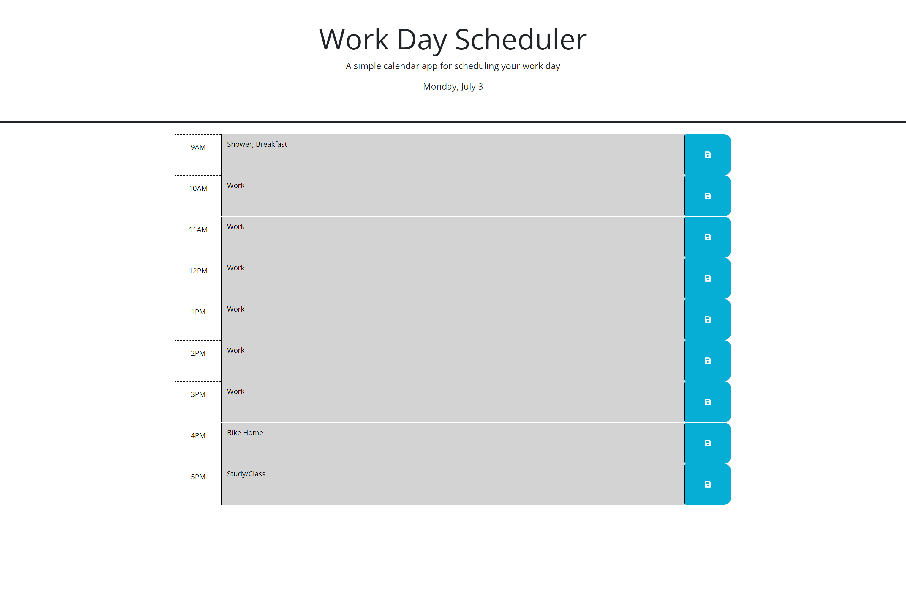

# Day Planner

## Descirption

This is simple day schedule application. Save events for each hour of the day in a time block from 9am to 5pm. On the top of the webpage is the current day, date and month. The time blocks are color coded depending on what time it is. They turn grey that hour has already passed, red if it is the current hour, and green if for hours in the future. If you are done typing an event, click the save button to save it so you don't lose your data. Saved events stay on the page even after you refresh.

For the Javascript, I have each time block for each hour saved in an array. That array is used to iterate through each time block and assign it a class based on if that block's hour is in the past, present, or future. I also have a javascript object with each hour as a key. When the user clicks the save button, their input is set as the value of whichever hour they were typing in and the object is saved in local storage. When the page is refreshed, javascript checks if their is anything in the local storage and saves it into the javascript object if there is.

## Link

https://jmcshan1.github.io/Day-Planner/
